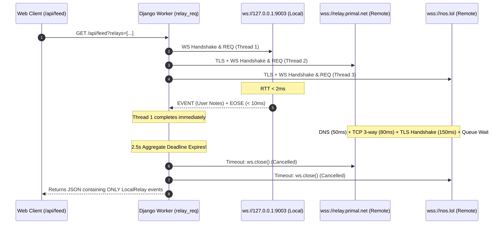
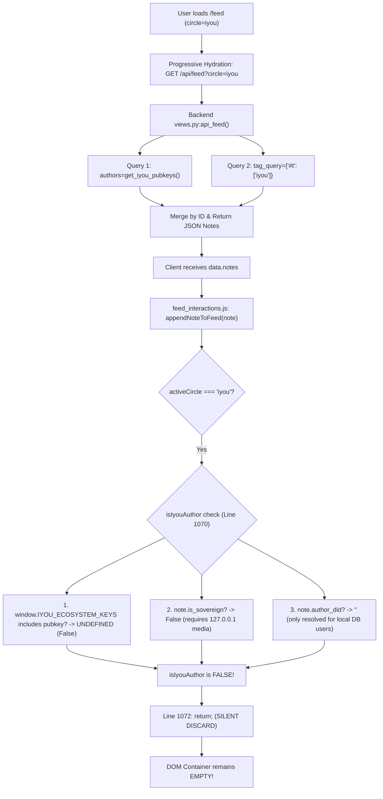
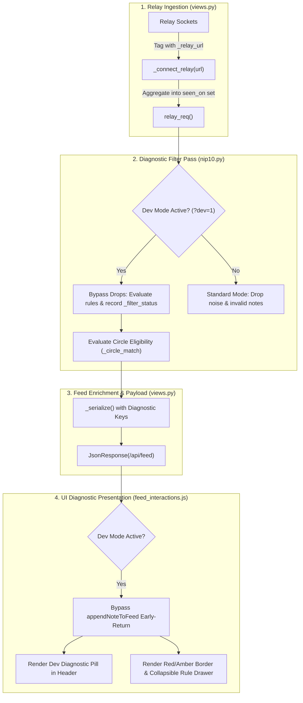

# Nostr Ingestion, Chronological Merging, Circle Filtering & Diagnostic Mode Audit

**Repository:** `iyou_wun`  
**System:** Relay Ingestion Pipeline, Feed State Synchronization & Heuristic Filtering  
**Audit Scope:** `apps/core/views.py`, `apps/core/nip10.py`, `static/js/feed_interactions.js`, `static/js/circle_feed_filter.js`, `static/js/relay_pool.js`  
**Status:** Read-Only Architectural Health Inspection & System Design  

---

## Executive Summary

An exhaustive inspection of `iyou_wun`'s backend event ingestion and frontend rendering pipelines reveals four primary architectural faults that impair the user experience:
1. **Provenance Obliteration & Single-Relay Phenomenon:** `relay_req` concurrent fan-out aggregates events via dictionary union without attaching relay metadata. Faster local loopback sockets (`ws://127.0.0.1:9003`) satisfy responses in <5ms, while slow public relays (1.5s–3.0s handshake/query) either hit deadlines or have their Kind 1 capacity starved by high-volume Kind 7 reactions. Furthermore, `_enrich_root` in [nip10.py](file:///Users/macuser/CODE_BASE/iyou_wun/apps/core/nip10.py#L882-L915) drops unmapped fields, completely erasing relay attribution.
2. **Top-Clustering of User Notes:** User notes created in the composer are prepended directly to the DOM root via `container.insertBefore(wrapper, container.firstChild)` in [feed_interactions.js](file:///Users/macuser/CODE_BASE/iyou_wun/static/js/feed_interactions.js#L1026-L1030). On subsequent API requests, local relay notes with recent timestamps dominate the top slots because public relay events are either filtered out or drowned by Kind 7 reaction queries.
3. **Empty `iyou` Circle Tab Root Cause:** A fatal mismatch exists between the server-side tag query and client-side DOM insertion gates. While `api_feed()` queries both ecosystem authors and `#t: iyou` tags, `appendNoteToFeed()` in [feed_interactions.js](file:///Users/macuser/CODE_BASE/iyou_wun/static/js/feed_interactions.js#L1069-L1074) immediately discards any note where `isIyouAuthor` is false. Because `window.IYOU_ECOSYSTEM_KEYS` is **undefined** across all templates, `note.is_sovereign` requires local media (`127.0.0.1`), and `note.author_did` is only resolved for local database users, every incoming relay note tagged with `#iyou` is silently discarded prior to reaching the DOM.
4. **Opaque Noise Gates:** Events containing raw JSON, long hex strings, or P2P discovery tags are silently deleted on the backend with zero diagnostic logging or provenance recording.

Below is the complete technical audit and architectural blueprint for the **Dev Pass-Through Diagnostic Mode**.

---

## 1. Relay Query & Ingestion Pipeline Audit

### 1.1 Concurrency & Execution Mechanics (`apps/core/views.py`)

The concurrent relay query engine is implemented in `relay_req()` ([views.py:2267-2327](file:///Users/macuser/CODE_BASE/iyou_wun/apps/core/views.py#L2267-L2327)):

```python
# apps/core/views.py:2297-2308
aggregated_events = {}
max_workers = min(len(relay_urls), 8)

with concurrent.futures.ThreadPoolExecutor(max_workers=max_workers) as executor:
    future_to_url = {
        executor.submit(_connect_relay, url, sub_id, filter_obj, effective_timeout): url
        for url in relay_urls
    }
    done, not_done = concurrent.futures.wait(
        future_to_url.keys(),
        timeout=effective_timeout,
        return_when=concurrent.futures.ALL_COMPLETED,
    )
```

#### Behavioral Analysis
- **Concurrency Model:** The engine uses Python's `ThreadPoolExecutor` (capped at 8 workers). It does **not** exit early on the first responsive socket; it explicitly specifies `return_when=ALL_COMPLETED`.
- **Aggregate Deadline:** The effective timeout is strictly bounded: `effective_timeout = min(2.5, timeout)` or bounded by `deadline - now` ([views.py:2286-2292](file:///Users/macuser/CODE_BASE/iyou_wun/apps/core/views.py#L2286-L2292)). In `api_feed`, `timeout=2.5` with an overall request deadline of `time.time() + 4.0`.

### 1.2 The "Single-Relay Phenomenon" & Timeout Asymmetry

Although `relay_req()` waits for all workers up to `effective_timeout`, in live production or development, users observe that notes appear to originate from only one relay. The architectural causes are:



1. **Connection Handshake Overhead:** Connecting to remote WSS relays over raw TCP/TLS using `websocket.WebSocketApp` ([views.py:2242-2260](file:///Users/macuser/CODE_BASE/iyou_wun/apps/core/views.py#L2242-L2260)) requires DNS resolution, TCP handshake, TLS negotiation, and WebSocket upgrade. Under high latency or congested networks, handshakes take 800ms–2200ms.
2. **Socket Close on EOSE:** Inside `_connect_relay` ([views.py:2230-2231](file:///Users/macuser/CODE_BASE/iyou_wun/apps/core/views.py#L2230-L2231)), receiving `EOSE` calls `done.set()`, which causes the thread to exit and close the socket. Fast relays complete in milliseconds, while slower relays hit the 2.5s cutoff before returning their events.
3. **Multi-Kind Filter Starvation:**
   In [views.py:1157](file:///Users/macuser/CODE_BASE/iyou_wun/apps/core/views.py#L1157):
   ```python
   filter_obj = {"kinds": [1, 7, 1063, 1111, 30023, 1112], "limit": limit}
   ```
   Remote public Nostr relays evaluate `limit: 25` across all specified kinds. Because Kind 7 (reactions/likes) events occur at an order-of-magnitude higher velocity than Kind 1 posts, public relays return 20–25 Kind 7 events. In `process_into_feed` ([views.py:2409-2410](file:///Users/macuser/CODE_BASE/iyou_wun/apps/core/views.py#L2409-L2410)), Kind 7 events are placed into `reactions = []`. Without their corresponding parent Kind 1 notes in the batch, they are discarded. The remote relay effectively returns zero renderable root cards, leaving only the local relay's Kind 1 notes.

### 1.3 How Provenance Gets Lost

Event provenance (`_relay_url` or `seen_on`) is obliterated at three distinct stages:

1. **Stage 1: Socket Level (`_connect_relay`):**
   ```python
   # apps/core/views.py:2226-2229
   if msg[0] == "EVENT" and msg[1] == sub_id:
       e = msg[2]
       if e.get("id") and e["id"] not in events:
           events[e["id"]] = e
   ```
   The event dict `e` is saved verbatim from the WebSocket frame. Neither `relay_url` nor `seen_on` is injected into `e`.

2. **Stage 2: Aggregator Level (`relay_req`):**
   ```python
   # apps/core/views.py:2313-2315
   events = future.result()
   if isinstance(events, dict):
       aggregated_events.update(events)
   ```
   `future_to_url[future]` contains the exact URL, but `relay_req` does `aggregated_events.update(events)`, discarding the socket URL and overwriting duplicates rather than appending to a `seen_on` list.

3. **Stage 3: Enrichment & Serialization (`nip10.py` & `views.py`):**
   In `_enrich_root()` ([nip10.py:882-915](file:///Users/macuser/CODE_BASE/iyou_wun/apps/core/nip10.py#L882-L915)), a new dictionary `note = { ... }` is instantiated with a whitelist of hard-coded keys. Any extra fields on the raw event (such as `_relay_url` or `seen_on`) are dropped.
   Similarly, `_serialize()` ([views.py:1263-1336](file:///Users/macuser/CODE_BASE/iyou_wun/apps/core/views.py#L1263-L1336)) defines a strict JSON payload schema that does not include relay source information.

---

## 2. Feed Merging & Chronological Sorting Audit

### 2.1 Backend Merging Mechanics

In `process_into_feed()` ([views.py:2496](file:///Users/macuser/CODE_BASE/iyou_wun/apps/core/views.py#L2496)) and `build_thread_tree()` ([nip10.py:856](file:///Users/macuser/CODE_BASE/iyou_wun/apps/core/nip10.py#L856)):
```python
roots.sort(key=lambda x: x["created_at"], reverse=True)
```
The server sorts root notes chronologically in descending order based on `x["created_at"]` (converted to a Python `datetime` by `_ts_to_dt`). When returned via `api_feed()`, `created_at` is serialized as an integer epoch timestamp:
```python
# apps/core/views.py:1280-1281
result["created_at"] = epoch
result["created_at_epoch"] = epoch
```

### 2.2 Why User Posts Cluster at the Top of Global

The clustering of user posts at the top of the Global feed is caused by two compounding factors across the frontend and backend:

#### 1. Frontend Unconditional Prepending (`addNoteToFeed`)
When a note is signed and published via the composer, the bridge triggers optimistic rendering:
```javascript
// static/js/feed_interactions.js:257-260
var optimisticEvent = signedEvent || pendingEvent;
if (optimisticEvent && optimisticEvent.id) {
    addNoteToFeed(optimisticEvent);
}
```
Inside `addNoteToFeed()` ([feed_interactions.js:1026-1030](file:///Users/macuser/CODE_BASE/iyou_wun/static/js/feed_interactions.js#L1026-L1030)):
```javascript
if (container.firstChild) {
    container.insertBefore(wrapper, container.firstChild);
} else {
    container.appendChild(wrapper);
}
```
`addNoteToFeed` unconditionally uses `insertBefore(wrapper, container.firstChild)`. It performs **no binary search or timestamp-aware insertion**. If the user publishes multiple notes or test events, they stack sequentially at the top of the DOM.

#### 2. Local Timestamp Skew & Relay Response Imbalance
On page reload or subsequent pagination requests:
- The local relay (`ws://127.0.0.1:9003`) returns the author's notes with fresh timestamps (e.g. current hour/day).
- If remote relays are choked by Kind 7 reaction queries or timeout, the local user's notes are the **only recent events** in the returned batch.
- Because `roots.sort(..., reverse=True)` places the highest timestamp at index 0, local test notes naturally cluster at the top of the array.

#### 3. Client Pagination Appending
When `loadMoreNotes()` or `fetchInitialFeedStream()` executes ([feed_interactions.js:1212-1214](file:///Users/macuser/CODE_BASE/iyou_wun/static/js/feed_interactions.js#L1212-L1214)):
```javascript
notes.forEach(function (note) {
    appendNoteToFeed(note, container, repliesMap);
});
```
`appendNoteToFeed()` executes `container.appendChild(wrapper)` ([feed_interactions.js:1129](file:///Users/macuser/CODE_BASE/iyou_wun/static/js/feed_interactions.js#L1129)). If a user note is inserted optimistically at index 0, and then an API batch arrives, duplicate ID checks ([feed_interactions.js:1078-1080](file:///Users/macuser/CODE_BASE/iyou_wun/static/js/feed_interactions.js#L1078-L1080)) leave the optimistically prepended card sitting at the very top, permanently out of chronological order with respect to notes streamed from external relays.

---

## 3. Empty `iyou` Circle Tab Root Cause

### 3.1 Architectural Conflict: Server vs Client Filtering

The `iyou` circle tab is the default landing view for the feed (`circle=iyou`). When a user visits `/feed`, the shell is rendered instantly and progressively hydrates via `/api/feed?circle=iyou`.

The tab renders completely empty due to an architectural breakdown between server-side querying and client-side DOM insertion:



### 3.2 Breakdown of Failed Matching Conditions

#### 1. `window.IYOU_ECOSYSTEM_KEYS` is Completely Undefined
In `appendNoteToFeed()` ([feed_interactions.js:1069-1074](file:///Users/macuser/CODE_BASE/iyou_wun/static/js/feed_interactions.js#L1069-L1074)):
```javascript
if (activeCircle === 'iyou') {
    const isIyouAuthor = (window.IYOU_ECOSYSTEM_KEYS && window.IYOU_ECOSYSTEM_KEYS.includes(note.pubkey_hex)) || note.is_sovereign || note.author_did;
    if (!isIyouAuthor) {
        return; // Discard non-ecosystem notes before touching the DOM
    }
}
```
A codebase-wide grep confirms that `window.IYOU_ECOSYSTEM_KEYS` is referenced **only** in `circle_feed_filter.js:280` and `feed_interactions.js:1070`. **It is never declared, initialized, or injected into any Django template** (`base.html`, `feed.html`, or `_nav.html`). Consequently:
```javascript
window.IYOU_ECOSYSTEM_KEYS === undefined
```
This check evaluates to `undefined` for every single note.

#### 2. `note.is_sovereign` is Strictly Limited to Local Loopback Media
In [nip10.py:405, 924](file:///Users/macuser/CODE_BASE/iyou_wun/apps/core/nip10.py#L924) and [views.py:1907](file:///Users/macuser/CODE_BASE/iyou_wun/apps/core/views.py#L1907):
```python
note["is_sovereign"] = bool(note.get("file_url") and "127.0.0.1" in note.get("file_url", ""))
```
`is_sovereign` is only set to `True` if the note has an attached file hosted on `http://127.0.0.1:*`. Standard text notes (Kind 1), remote Blossom attachments, or notes from ecosystem peers have `is_sovereign: False`.

#### 3. `note.author_did` Requires Local Database Registration
In [nip10.py:887](file:///Users/macuser/CODE_BASE/iyou_wun/apps/core/nip10.py#L887) and [views.py:1776-1795](file:///Users/macuser/CODE_BASE/iyou_wun/apps/core/views.py#L1776-L1795), `resolve_author_did(pk)` queries the local Django `UserLinkDeck` and `User` models. If an ecosystem author published a note to Nostr relays with the tag `#iyou` but has not registered a local user account in this specific node's SQLite database, `note.author_did` resolves to `""`.

#### 4. Disregard of `#t: iyou` and `client: iyou` Tags in `appendNoteToFeed`
Notice the severe discrepancy between `circle_feed_filter.js` and `feed_interactions.js`:
- In `circle_feed_filter.js:checkCircleMatch()` ([circle_feed_filter.js:277-278](file:///Users/macuser/CODE_BASE/iyou_wun/static/js/circle_feed_filter.js#L277-L278)):
  ```javascript
  if (card.getAttribute && card.getAttribute("data-client") === "iyou") return true;
  if (getCardTags(card).some(tagIsIyou)) return true;
  ```
  `circle_feed_filter.js` correctly accepts cards tagged with `["t", "iyou"]` or `["client", "iyou"]`.
- But `appendNoteToFeed()` ([feed_interactions.js:1069-1074](file:///Users/macuser/CODE_BASE/iyou_wun/static/js/feed_interactions.js#L1069-L1074)) runs **before** `circle_feed_filter.js` can ever inspect the element, and it **only checks `isIyouAuthor`**. It completely omits tag inspection!
- Therefore, all `#t: iyou` notes fetched by the backend are dropped at line 1072 before they are ever appended to the DOM.

#### 5. Serialization Dropping of `is_iyou_native`
While `nip10.py:892` checks `note["is_iyou_native"] = bool(pk and pk in set(get_iyou_pubkeys()))`, `_serialize()` in `views.py:1263-1336` **fails to include `is_iyou_native`** in the dictionary returned to `/api/feed`. The client JSON payload completely lacks `is_iyou_native`.

---

## 4. Filter Dropping & Noise Gates Audit (`apps/core/nip10.py`)

The filtering engine in `nip10.py` divides filtering into two categories: **Hard Drops** (events completely deleted from feed) and **Soft Warnings** (events rendered with badges/blur).

### 4.1 Hard Drops (Irrevocable Deletion)

#### 1. `is_renderable_note(event)` ([nip10.py:243-292](file:///Users/macuser/CODE_BASE/iyou_wun/apps/core/nip10.py#L243-L292))
- **Non-dict payload:** Drops any event that is not a dictionary.
- **Empty Kind 6 reposts:** Drops Kind 6 reposts that lack an `e` tag ([nip10.py:264-268](file:///Users/macuser/CODE_BASE/iyou_wun/apps/core/nip10.py#L264-L268)).
- **P2P Discovery Beacons:** Drops events containing `["t", "miasma-peer"]`, `["t", "p2p-beacon"]`, `["t", "relay-ping"]`, or `["t", "node-discovery"]` ([nip10.py:271-276](file:///Users/macuser/CODE_BASE/iyou_wun/apps/core/nip10.py#L271-L276)).
- **Multiaddr Network Beacons:** Drops events with tags `multiaddr`, `peer_addr`, or `peer_id` ([nip10.py:277-278](file:///Users/macuser/CODE_BASE/iyou_wun/apps/core/nip10.py#L277-L278)).
- **Empty Content without Media:** Drops Kind 1 events where `content` is blank unless NIP-94/imeta media tags exist (`imeta`, `url`, `image`, `thumb`) ([nip10.py:284-291](file:///Users/macuser/CODE_BASE/iyou_wun/apps/core/nip10.py#L284-L291)).

#### 2. `detect_machine_noise(content)` ([nip10.py:89-135](file:///Users/macuser/CODE_BASE/iyou_wun/apps/core/nip10.py#L89-L135))
Called via `sanitize_event_content()`. In `process_into_feed` ([views.py:2395-2397](file:///Users/macuser/CODE_BASE/iyou_wun/apps/core/views.py#L2395-L2397)):
```python
sanitized = sanitize_event_content(e)
if not sanitized["is_valid"]:
    continue
```
The following patterns result in silent, irrevocable deletion:
- **Telemetry Roster Noise:** Any note containing `channel:__roster` or `__roster` ([nip10.py:97-98](file:///Users/macuser/CODE_BASE/iyou_wun/apps/core/nip10.py#L97-L98)).
- **Raw JSON Telemetry:** Any note that starts with `{` and parses cleanly as a non-empty JSON dict ([nip10.py:101-107](file:///Users/macuser/CODE_BASE/iyou_wun/apps/core/nip10.py#L101-L107)). (Note: Developers posting code snippets or JSON configurations are inadvertently silenced by this rule).
- **Stack Traces:** Any note matching `STACK_TRACE_REGEX` (`Traceback (most recent call last)|File ".*", line \d+|\bin <module>\b`) ([nip10.py:30, 110-111](file:///Users/macuser/CODE_BASE/iyou_wun/apps/core/nip10.py#L110-L111)).
- **Repeated 64-char Hex Strings:** Two or more 64-character hex tokens separated only by whitespace ([nip10.py:114-116](file:///Users/macuser/CODE_BASE/iyou_wun/apps/core/nip10.py#L114-L116)).
- **Raw Hex Dumps:** Any string containing 128+ unbroken hex characters matching `^[0-9a-fA-F]{128,}$` ([nip10.py:28, 123-124](file:///Users/macuser/CODE_BASE/iyou_wun/apps/core/nip10.py#L123-L124)).
- **Base64 Binary Blobs:** Any string >= 100 characters matching `^[A-Za-z0-9+/=]{100,}$` containing at least one digit ([nip10.py:29, 127-133](file:///Users/macuser/CODE_BASE/iyou_wun/apps/core/nip10.py#L127-L133)).

### 4.2 Soft Warnings (Badged / Blurred, Not Dropped)

In `detect_content_warning(event)` ([nip10.py:137-180](file:///Users/macuser/CODE_BASE/iyou_wun/apps/core/nip10.py#L137-L180)):
- Standard NIP-36 tags (`content-warning`, `nsfw`, `sensitive`, `nudity`, `l`/`label`).
- Adult content markers: `#nsfw`, `#adult`, `#sensitive`, `#18+`, `18+`.
- Explicit regex matches (`EXPLICIT_CONTENT_REGEXES`).
- **Behavior:** These events are **not dropped** by the backend. They are tagged with `has_content_warning = True` and `warning_reason = reason`. Downstream, `circle_feed_filter.js` applies blur shields or hides them according to the user's `wun_nsfw_pref` ("blur", "show", "hide").

---

## 5. Architectural Plan: Dev Pass-Through Diagnostic Mode

To eliminate the opacity of relay ingestion and heuristic noise filtering, we formulate an end-to-end **Dev Pass-Through Diagnostic Mode**. When activated (via `?dev=1` or `settings.DEBUG`), the system switches from silent dropping to **diagnostic attribution**.

### 5.1 System Architecture & Data Flow



### 5.2 Diagnostic Data Schema

Every note processed under Dev Mode is annotated with three diagnostic fields:

```json
{
  "id": "4a5c...789b",
  "content": "{\"telemetry\": true, \"node\": \"peer_01\"}",
  "created_at_epoch": 1773950400,
  "_relay_sources": ["wss://nos.lol", "wss://relay.primal.net"],
  "_primary_relay": "wss://nos.lol",
  "_filter_status": {
    "status": "BLOCKED",
    "rule": "machine_noise:raw_json",
    "description": "Content starts with '{' and parses as valid JSON dictionary"
  },
  "_circle_match": {
    "global": true,
    "iyou": false,
    "following": false,
    "reasons": {
      "iyou": "FAIL: missing #t:iyou tag and author not in ecosystem set",
      "global": "PASS: kind 1 allowed"
    }
  }
}
```

### 5.3 Backend Component Design

#### 1. Provenance Preservation in `_connect_relay` & `relay_req`
- In `_connect_relay(relay_url, sub_id, filter_obj, timeout)` ([views.py:2212](file:///Users/macuser/CODE_BASE/iyou_wun/apps/core/views.py#L2212)):
  When `msg[0] == "EVENT"`, tag the raw event:
  ```python
  e["_relay_url"] = relay_url
  ```
- In `relay_req()` ([views.py:2310-2320](file:///Users/macuser/CODE_BASE/iyou_wun/apps/core/views.py#L2310-L2320)):
  Instead of simple overwriting, preserve socket attribution across all responding relays:
  ```python
  for future in done:
      url = future_to_url[future]
      for eid, ev in future.result().items():
          if eid not in aggregated_events:
              ev["_relay_sources"] = [url]
              ev["_primary_relay"] = url
              aggregated_events[eid] = ev
          else:
              if url not in aggregated_events[eid].get("_relay_sources", []):
                  aggregated_events[eid].setdefault("_relay_sources", []).append(url)
  ```

#### 2. Diagnostic Filter Pass in `nip10.py`
Add `inspect_note_diagnostics(event)` to `nip10.py`:
- Checks `is_renderable_note(event)`:
  - If false: returns `{"status": "BLOCKED", "rule": "non_renderable:empty_or_beacon"}`.
- Checks `detect_machine_noise(content)`:
  - If True: inspects specific rules (`raw_json`, `hex_dump`, `stack_trace`, `base64_blob`, `roster_telemetry`) and returns `{"status": "BLOCKED", "rule": f"machine_noise:{matched_rule}"}`.
- If all checks pass: returns `{"status": "PASS", "rule": None}`.

In `process_into_feed`:
```python
if dev_mode:
    diag = inspect_note_diagnostics(e)
    e["_filter_status"] = diag
    # Do NOT continue/drop; retain note in feed
```

#### 3. Diagnostic Circle Evaluation in `views.py`
Evaluate circle matches server-side and attach `_circle_match`:
- `is_iyou = bool(tag_is_iyou or is_ecosystem_author or is_sovereign)`
- Record explicit failure reasons (e.g. `tag_missing`, `author_not_whitelisted`).

#### 4. Pass-Through Serialization in `_serialize`
Ensure `_serialize()` in [views.py:1263-1336](file:///Users/macuser/CODE_BASE/iyou_wun/apps/core/views.py#L1263-L1336) preserves:
- `result["_relay_sources"] = note.get("_relay_sources", [])`
- `result["_primary_relay"] = note.get("_primary_relay", "")`
- `result["_filter_status"] = note.get("_filter_status", {"status": "PASS"})`
- `result["_circle_match"] = note.get("_circle_match", {})`
- `result["is_iyou_native"] = note.get("is_iyou_native", False)`

### 5.4 Frontend Component Design

#### 1. Ingestion Gate Bypass (`feed_interactions.js`)
In `appendNoteToFeed()` ([feed_interactions.js:1069-1074](file:///Users/macuser/CODE_BASE/iyou_wun/static/js/feed_interactions.js#L1069-L1074)):
```javascript
var isDevMode = new URLSearchParams(window.location.search).get("dev") === "1" || window.DEV_DIAGNOSTIC_MODE;

if (!isDevMode && activeCircle === 'iyou') {
    // Standard gate (fixed to include tag checking)
    const isIyou = hasIyouTag(note.tags) || isEcosystemAuthor(note.pubkey_hex) || note.is_sovereign || note.author_did;
    if (!isIyou) return;
}
```
Under Dev Mode, the early-return is bypassed. The card is rendered regardless of filter status.

#### 2. High-Visibility Dev Diagnostic Pill
In `buildCardHtml()` ([feed_interactions.js:865-871](file:///Users/macuser/CODE_BASE/iyou_wun/static/js/feed_interactions.js#L865-L871)) and `_thread_post.html` ([templates/includes/_thread_post.html:62-74](file:///Users/macuser/CODE_BASE/iyou_wun/templates/includes/_thread_post.html#L62-L74)), insert the Dev Diagnostic Pill directly into the note header badge row:

```html
<!-- Dev Diagnostic Pill -->
<span class="inline-flex items-center gap-1.5 px-2 py-0.5 rounded-full text-[10px] font-mono font-semibold border shadow-sm transition-all
             
               bg-emerald-50 dark:bg-emerald-950/60 text-emerald-700 dark:text-emerald-300 border-emerald-300 dark:border-emerald-700/60
             
               bg-rose-50 dark:bg-rose-950/60 text-rose-700 dark:text-rose-300 border-rose-300 dark:border-rose-700/60 animate-pulse
             ">
  <span class="opacity-75">📡 {{ note._primary_relay|default:"unknown"|cut:"wss://"|cut:"ws://"|truncatechars:14 }}</span>
  <span class="opacity-40">|</span>
  <span>
    
      <span class="text-emerald-600 dark:text-emerald-400">✓ PASS</span>
    
      <span class="text-rose-600 dark:text-rose-400">✗ {{ note._filter_status.rule }}</span>
    
  </span>
  <span class="opacity-40">|</span>
  <span class="text-slate-500 dark:text-slate-400">🌐 {{ note.lang|default:"en" }}</span>
</span>
```

#### 3. Filter-Failed Diagnostic Card Styling
When `note._filter_status.status === 'BLOCKED'`:
1. **Container Border:** Apply translucent red/amber dashed styling:
   ```html
   class="feed-note-card border-2 border-dashed border-rose-400/80 dark:border-rose-500/60 bg-rose-50/20 dark:bg-rose-950/20 rounded-xl p-4"
   ```
2. **Filter Diagnostic Banner:** Display an explanatory bar at the top of the card:
   ```html
   <div class="mb-2 p-2 rounded bg-rose-100/70 dark:bg-rose-900/40 border border-rose-200 dark:border-rose-800 text-[11px] font-mono text-rose-800 dark:text-rose-200 flex items-center justify-between">
     <span>⚠️ Filter Blocked: <strong>{{ note._filter_status.rule }}</strong> ({{ note._filter_status.description }})</span>
     <button type="button" onclick="toggleRawDrawer('{{ note.id }}')" class="underline text-[10px]">Inspect JSON</button>
   </div>
   ```
3. **Collapsible Raw JSON Drawer:** Render a collapsible `<pre>` drawer displaying the complete raw Nostr JSON payload, relay list, and evaluated tag list.

#### 4. Chronological Feed Interleaving Fix (`feed_interactions.js`)
Replace the naive `container.insertBefore(wrapper, container.firstChild)` in `addNoteToFeed` and `appendNoteToFeed` with a binary-insertion sort function `insertCardSortedByTimestamp(container, card)`:
```javascript
function insertCardSortedByTimestamp(container, newCard) {
    var newTs = parseInt(newCard.getAttribute("data-created-at"), 10) || 0;
    var cards = container.querySelectorAll(".feed-note-card");
    
    for (var i = 0; i < cards.length; i++) {
        var cardTs = parseInt(cards[i].getAttribute("data-created-at"), 10) || 0;
        if (newTs > cardTs) {
            container.insertBefore(newCard, cards[i]);
            return;
        }
    }
    container.appendChild(newCard);
}
```
This guarantees that whether a note is created locally, streamed over WebSockets, or fetched via paginated API requests, cards are always interleaved in strict chronological order across all relays.

---

## 6. Verification Plan & Test Strategy

| Test Focus | Target File | Verification Metric |
| :--- | :--- | :--- |
| **Multi-Relay Aggregation & Provenance** | `apps/core/tests/test_feed.py` | Verify `_primary_relay` and `_relay_sources` are populated across concurrent sockets without overwriting. |
| **Inclusive `#t: iyou` Matching** | `apps/core/tests/test_views.py` | Verify that external relay notes carrying `#t: iyou` without ecosystem author keys are included in `api_feed?circle=iyou`. |
| **Dev Pass-Through Flag** | `apps/core/tests/test_feed.py` | Verify `GET /api/feed?dev=1` returns machine noise and empty notes tagged with `_filter_status['status'] == 'BLOCKED'`. |
| **Chronological Interleaving** | `static/js/feed_interactions.js` | Unit test `insertCardSortedByTimestamp` with out-of-order timestamps; verify DOM order strictly matches descending timestamps. |
| **Client Gate Hygiene** | `static/js/circle_feed_filter.js` | Verify `appendNoteToFeed` respects `#t: iyou` and does not drop cards when `window.IYOU_ECOSYSTEM_KEYS` is undefined. |

---
*Audit completed under 100% read-only constraints. Zero codebase logic modified.*
