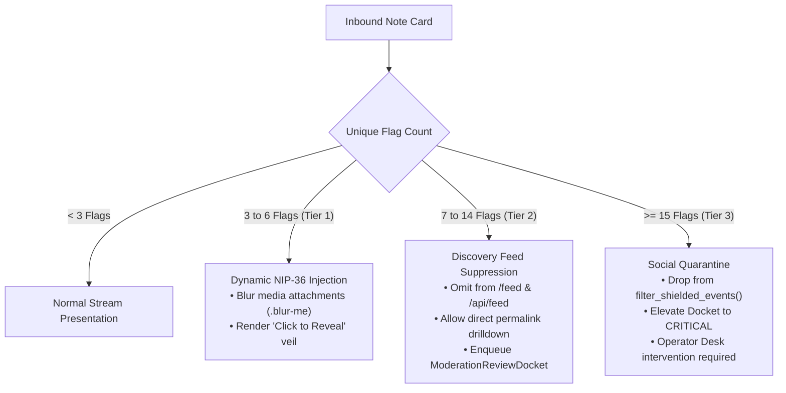
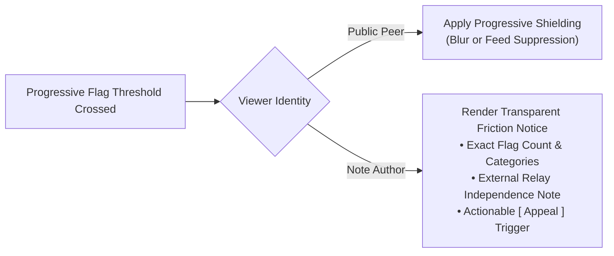

# Sovereign Moderation Shield & Node Takedown Engine Specification

**Specification Identifier:** `OMNI-SHIELD-SPEC-V1`  
**Hub:** `omni_social` / `iyou_wun`  
**Status:** Canonical Standard  
**Published:** 2026-09-18  
**Target Implementers:** `iyou_wun`, `iyou_home`, `iyou_idp`, `omni_social` satellites  

---

## 1. Executive Summary & Core Philosophy

Decentralized social networks built on Nostr and Blossom solve the existential threats of platform lock-in, shadowbanning, and centralized identity expropriation. In a pure sovereign mesh, content is cryptographically signed by user Decentralized Identifiers (DIDs) / Schnorr keypairs and gossiped across independent relays, while binary assets are content-addressed by SHA-256 digests.

However, sovereign node operators run physical infrastructure in specific legal jurisdictions. Operators face statutory liabilities, including:
- Digital Millennium Copyright Act (DMCA §512) notice-and-takedown obligations;
- EU Digital Services Act (DSA) illegal content mitigation mandates;
- Local child sexual abuse material (CSAM), non-consensual imagery, malware, or extortion statutes;
- Hosting provider and cloud infrastructure Terms of Service constraints.

The **Sovereign Moderation Shield** resolves the fundamental tension between **protocol-level censorship resistance** and **node-level safe harbor compliance**. 

```
┌─────────────────────────────────────────────────────────────────────────────┐
│                             UPSTREAM PROTOCOL LAYER                         │
│   • Decentralized Nostr Relays (nos.lol, relay.iyou.me, relay.damus.io)    │
│   • Sovereign Keypairs & DIDs (secp256k1, Ed25519)                          │
│   • Global Blossom Network (cdn.iyou.me, nostr.download)                   │
│   ─── Immutable, Censorship-Resistant, Cryptographically Sovereign ───      │
└──────────────────────────────────────┬──────────────────────────────────────┘
                                       │ Ingestion / Subscriptions
                                       ▼
┌─────────────────────────────────────────────────────────────────────────────┐
│                          NODE INSTANCE LAYER (iyou_wun)                     │
│  ┌───────────────────────────────────────────────────────────────────────┐  │
│  │                    SOVEREIGN MODERATION SHIELD                        │  │
│  │  • NodeBlockedEntity (Pubkey / DID / Domain Suppression)              │  │
│  │  • NodeContentTakedown (Event ID & Media Hash Suppression)            │  │
│  │  • In-Memory Shield Cache (`apps/core/moderation.py`)                 │  │
│  │  • Blossom Port 9002 REST DELETE Media Scrubber                      │  │
│  └───────────────────────────────────────────────────────────────────────┘  │
│                                      │                                      │
│        ┌─────────────────────────────┴─────────────────────────────┐        │
│        ▼                                                           ▼        │
│  ┌───────────────┐                                           ┌───────────┐  │
│  │  Social Feed  │                                           │ Civic     │  │
│  │  & Discovery  │ (Filtered by Shield)                      │ Polling   │  │
│  │  (/feed, API) │                                           │ (/api/    │  │
│  └───────────────┘                                           │  vote)    │  │
│                                                              └─────┬─────┘  │
└────────────────────────────────────────────────────────────────────┼────────┘
                                                                     ▼
                                                         Strictly Decoupled:
                                                         Poly Engine (:8002)
                                                         (Shield CANNOT block)
```

---

## 2. Architectural Scope

### 2.1 Instance-Level Defensive Kill-Switch

The Sovereign Moderation Shield is strictly an **instance-level defensive kill-switch** operating within the boundaries of the local `iyou_wun` satellite.

1. **Defensive Safe Harbor:** The shield provides the node operator with the administrative controls required to immediately halt the processing, projection, indexing, caching, and serving of illegal, infringing, or non-compliant content.
2. **Local Interface Boundary:** Enforcement occurs at the edge of the node's user-facing services:
   - Web feeds (`FeedView`, `api_feed`);
   - Thread lineage views (`fetch_thread`, note hero drill-down);
   - Profile notes and gallery views (`api_profile_notes`, `api_gallery`);
   - Search indexing and progressive search dropdowns (`api_search`);
   - Local Blossom media server filesystem (`http://127.0.0.1:9002/`).

### 2.2 Cryptographic Non-Infringement & Upstream Independence

The shield MUST NOT compromise or attempt to compromise upstream protocol integrity:
- **No Upstream Relay Tampering:** The node DOES NOT broadcast synthetic deletion events or tombstone records masquerading as network consensus. Events on third-party Nostr relays remain unmodified.
- **No DID Key Invalidation:** The node DOES NOT and CANNOT revoke, alter, or seize user cryptographic keypairs (`did:key:...` or Nostr secp256k1 pubkeys). Cryptographic ownership remains intact.
- **Zero Network Censorship:** An entity or event suppressed on `iyou_wun` instance $A$ remains discoverable on independent instance $B$ or native Nostr desktop/mobile clients querying the relay mesh directly.
- **Operator Self-Defense Exclusivity:** The engine’s sole jurisdiction is the local node's digital footprint and physical disks.

---

## 3. Database Architecture & The Postgres Indexing Invariant

### 3.1 The Canonical Rule: "Postgres is for Indexing, Not Ownership"

The ecosystem enforces a strict architectural invariant:
> **Relational databases serve exclusively as transient local projection caches. The canonical source of truth consists exclusively of signed Nostr events and content-addressed Blossom blobs. Postgres owns nothing.**

In the context of the Moderation Shield:
1. **Disposable Suppression Indices:** The suppression tables (`NodeBlockedEntity`, `NodeContentTakedown`) are disposable local indices rather than authoritative state.
2. **Crash & Purge Resilience:** A node operator can execute `DROP DATABASE`, re-provision PostgreSQL, run standard migrations, and re-import or re-index without corrupting sovereign identities or user assets.
3. **Canonical Identifier Anchoring:** Records reference universal cryptographic primitives:
   - 64-character hexadecimal Nostr pubkeys (`nostr_pubkey`);
   - W3C Decentralized Identifiers (`entity_did`);
   - 64-character hexadecimal Nostr Event IDs (`event_id`);
   - SHA-256 hexadecimal digests for Blossom media (`media_sha256`).
   No synthetic database auto-increment IDs are treated as universal foreign keys across systems.

### 3.2 Data Models (`apps/core/models.py`)

#### `NodeBlockedEntity`
Suppresses all incoming and cached content produced by a specific cryptographic actor or domain.

```python
class NodeBlockedEntity(models.Model):
    ENTITY_TYPE_CHOICES = [
        ("pubkey", "Nostr Pubkey (64-hex)"),
        ("did", "Decentralized Identifier (DID)"),
        ("domain", "Domain / NIP-05"),
    ]

    identifier = models.CharField(
        max_length=512,
        unique=True,
        db_index=True,
        help_text="Target 64-hex pubkey, DID URI, or NIP-05 domain to suppress.",
    )
    entity_type = models.CharField(
        max_length=16,
        choices=ENTITY_TYPE_CHOICES,
        default="pubkey",
    )
    reason = models.CharField(
        max_length=255,
        blank=True,
        default="",
        help_text="Operator reason or legal classification (e.g. DMCA, CSAM, Spam, Harassment).",
    )
    legal_reference = models.CharField(
        max_length=255,
        blank=True,
        default="",
        help_text="External case number, court order ID, or takedown notice ticket.",
    )
    blocked_by_did = models.CharField(
        max_length=512,
        help_text="Sovereign DID of the operator who enacted this block.",
    )
    is_active = models.BooleanField(
        default=True,
        db_index=True,
        help_text="Whether this block rule is actively enforced.",
    )
    created_at = models.DateTimeField(auto_now_add=True)
    updated_at = models.DateTimeField(auto_now=True)

    class Meta:
        ordering = ["-created_at"]
        verbose_name = "Node Blocked Entity"
        verbose_name_plural = "Node Blocked Entities"

    def __str__(self):
        return f"<NodeBlockedEntity {self.entity_type}:{self.identifier[:16]}... active={self.is_active}>"
```

#### `NodeContentTakedown`
Suppresses specific message events or purges/blocks specific media blobs.

```python
class NodeContentTakedown(models.Model):
    TAKEDOWN_TYPE_CHOICES = [
        ("event", "Nostr Event"),
        ("media", "Blossom Media Blob (SHA-256)"),
        ("both", "Event & Associated Media"),
    ]

    target_id = models.CharField(
        max_length=64,
        unique=True,
        db_index=True,
        help_text="Nostr Event ID (64-hex) or Blossom Blob SHA-256 (64-hex).",
    )
    takedown_type = models.CharField(
        max_length=16,
        choices=TAKEDOWN_TYPE_CHOICES,
        default="event",
    )
    author_pubkey = models.CharField(
        max_length=64,
        blank=True,
        default="",
        db_index=True,
        help_text="Author pubkey (if known) for correlation.",
    )
    media_sha256 = models.CharField(
        max_length=64,
        blank=True,
        default="",
        db_index=True,
        help_text="Specific Blossom SHA-256 hash scrubbed.",
    )
    reason = models.CharField(
        max_length=255,
        blank=True,
        default="",
        help_text="Statutory ground or takedown justification.",
    )
    legal_reference = models.CharField(
        max_length=255,
        blank=True,
        default="",
        help_text="Court order, DMCA notice ID, or law enforcement docket.",
    )
    taken_down_by_did = models.CharField(
        max_length=512,
        help_text="Sovereign DID of the operator who executed the takedown.",
    )
    scrubbed_from_blossom = models.BooleanField(
        default=False,
        help_text="Indicates whether REST DELETE was confirmed against local Blossom daemon (:9002).",
    )
    is_active = models.BooleanField(
        default=True,
        db_index=True,
        help_text="Whether this takedown is actively suppressing content.",
    )
    created_at = models.DateTimeField(auto_now_add=True)
    updated_at = models.DateTimeField(auto_now=True)

    class Meta:
        ordering = ["-created_at"]
        verbose_name = "Node Content Takedown"
        verbose_name_plural = "Node Content Takedowns"

    def __str__(self):
        return f"<NodeContentTakedown {self.takedown_type}:{self.target_id[:16]}... active={self.is_active}>"
```

### 3.3 High-Performance In-Memory Filter Cache (`apps/core/moderation.py`)

Evaluating database rows for every note card across high-concurrency feeds creates intolerable $N+1$ query latency. `apps/core/moderation.py` implements an atomic in-memory cache layer:

```python
class ModerationShieldCache:
    """
    Thread-safe, in-memory cache of active suppression identifiers.
    Synchronized lazily with DB state or eagerly on desk mutations.
    """
    _instance = None
    _lock = threading.Lock()

    def __init__(self):
        self._blocked_pubkeys: set[str] = set()
        self._blocked_dids: set[str] = set()
        self._blocked_domains: set[str] = set()
        self._takedown_events: set[str] = set()
        self._takedown_media: set[str] = set()
        self._last_loaded: float = 0.0
        self._ttl: float = 60.0  # Periodic refresh fallback
```

- **Warmup:** Loaded on application startup and cached in memory.
- **Sub-Millisecond Check:** Checking `is_event_shielded(event)` performs zero SQL queries, doing set lookups:
  ```python
  event_id in cache.takedown_events or pubkey in cache.blocked_pubkeys
  ```
- **Cache Invalidation:** Any administrative mutation through `/desk/moderation/` immediately calls `moderation_shield_cache.invalidate()`, forcing a synchronous reload.

---

## 4. Decoupled Governance Invariant (The Poly Separation of Powers)

### 4.1 Constitutional Separation: Social Speech vs. Civic Franchise

A cornerstone of the sovereign media ecosystem is the constitutional separation between social media curation and democratic governance rights.

- **Social Feed Curation:** Node operators have the right and legal duty to curate, moderate, and suppress speech presented on their private domain or public web feed.
- **Democratic Franchise:** A user’s civic voting rights stem from their cryptographic DID, identity attestations, and verifiable credentials. Democratic franchise is NOT a privilege granted by a social media feed administrator.

### 4.2 Strict Isolation of `/api/vote` & `POLY_ENGINE_URL`

The headless Poly governance engine operates at `POLY_ENGINE_URL` (standard port `:8002`). Votes are cast via `POST /api/vote` in `apps/core/views.py`:

```
┌────────────────────────────────────────────────────────────────────────┐
│                        INGRESS REQUEST ROUTING                         │
└───────────────────┬────────────────────────────────┬───────────────────┘
                    │                                │
                    ▼                                ▼
     Social Feed Request (/feed, API)       Civic Ballot (/api/vote)
                    │                                │
                    ▼                                │
     ┌─────────────────────────────┐                 │
     │   Moderation Shield Gate    │                 │
     │  `filter_shielded_events()` │                 │
     │  Checks: NodeBlockedEntity  │                 │
     │          NodeContentTakedown│                 │
     └──────────────┬──────────────┘                 │
                    │ Passes                         │
                    ▼                                ▼
     ┌─────────────────────────────┐    ┌───────────────────────────┐
     │ Render Stream / JSON Cards  │    │ Direct Pass-Through:      │
     │                             │    │ Validate DID & Signature  │
     │                             │    │ Proxy to POLY_ENGINE_URL  │
     │                             │    │ (:8002) via PolyClient    │
     └─────────────────────────────┘    └───────────────────────────┘
                                                     │
                                         [SHIELD IS STRICTLY BYPASSED]
```

**Normative Invariant:**
> **The Sovereign Moderation Shield MUST NOT intercept, evaluate, or reject requests to `/api/vote`.**
> Even if a pubkey or DID is actively suppressed in `NodeBlockedEntity` or `NodeContentTakedown`, `api_cast_vote()` SHALL process their cryptographically signed vote envelope without prejudice.
> Social muting or legal takedowns SHALL NEVER disenfranchise a user from civic voting.

---

## 5. Blossom Media Scrubbing Engine

### 5.1 BUD-01 / BUD-02 REST DELETE Contract

The Blossom protocol defines content-addressed media storage. Media files uploaded by users are stored on the local media daemon at `http://127.0.0.1:9002/<sha256>`.

Under BUD-01 and BUD-02, the local daemon exposes a REST `DELETE` interface:

```http
DELETE /{sha256} HTTP/1.1
Host: 127.0.0.1:9002
Authorization: Nostr <base64-encoded-nip98-or-bud02-signed-event>
```

### 5.2 Local Storage Scrubbing Lifecycle

When a takedown order targeting media is processed at the Moderation Desk:

```
[Admin Desk: Takedown Action]
            │
            ├────────────────────────────────────────────────┐
            ▼                                                ▼
 1. Write `NodeContentTakedown`                    2. Issue REST DELETE Call
    target_id = <sha256>                              http://127.0.0.1:9002/<sha256>
    takedown_type = "media"                           (Local Media Daemon)
    scrubbed_from_blossom = False                            │
            │                                                ▼
            │                                     3. Local Disk Eviction
            │                                        File wiped from block store
            │                                                │
            │◀─────── Confirm 200/204 / 404 ─────────────────┘
            ▼
 4. Update `scrubbed_from_blossom = True`
 5. Invalidate In-Memory Shield Cache
 6. Return Clean Status to Admin Desk
```

### 5.3 Implementation Contract (`apps/core/moderation.py`)

```python
def scrub_blossom_media(sha256_hash: str, timeout: float = 3.0) -> bool:
    """
    Executes REST DELETE against the local Blossom daemon at port 9002.
    Confirms physical eviction of the blob from local node disks.
    """
    clean_hash = sha256_hash.strip().lower()
    daemon_url = f"http://127.0.0.1:9002/{clean_hash}"
    
    req = urllib.request.Request(daemon_url, method="DELETE")
    req.add_header("User-Agent", "iyou-wun-moderation-shield/1.0")
    
    try:
        with urllib.request.urlopen(req, timeout=timeout) as resp:
            if resp.status in (200, 204):
                logger.info(f"Successfully scrubbed Blossom blob {clean_hash} from local daemon.")
                return True
    except urllib.error.HTTPError as exc:
        if exc.code == 404:
            logger.warning(f"Blossom blob {clean_hash} already absent on daemon (404).")
            return True
        logger.error(f"HTTP error during Blossom scrubbing for {clean_hash}: {exc.code}")
    except Exception as exc:
        logger.error(f"Failed to connect to local Blossom daemon at {daemon_url}: {exc}")
    
    return False
```

### 5.4 Multi-Tier Media Proxy Defense

Even if an asset remains on public mirrors (`https://cdn.iyou.me/<sha256>`, `https://nostr.download/<sha256>`), the local node:
1. Refuses to proxy or serve the asset via `/media/` endpoints;
2. Filters out or censors `` / `<video>` embeds pointing to `target_id == sha256`;
3. Ensures zero bytes of the contraband material exist on the operator's physical host storage.

---

## 6. Sovereign Access Control & Administration

### 6.1 `ADMIN_DID` Posture Evaluation

Administrative access to the Sovereign Moderation Shield is strictly guarded by the sovereign identity posture evaluation routine:

1. **Passwordless Ingress:** Password authentication is deprecated across the ecosystem. User authentication is managed exclusively via OIDC PKCE against `iyou_idp`.
2. **DID Matching:** In `apps/core/auth.py`, `_evaluate_admin_elevation()` compares the user's `sub` claim DID against `settings.ADMIN_DID`:
   ```python
   def _evaluate_admin_elevation(self, user, claims=None):
       if not user or user.is_anonymous:
           return user
       if user.username == getattr(settings, "ADMIN_DID", None):
           user.is_staff = True
           user.is_superuser = True
           user.save(update_fields=["is_staff", "is_superuser"])
       return user
   ```
3. **Staff Gating:** The administration views in `apps/core/views_admin.py` are strictly protected:
   ```python
   @user_passes_test(lambda u: u.is_authenticated and u.is_staff)
   def moderation_desk_view(request): ...
   ```

### 6.2 Administrative Desk (`/desk/moderation/`)

The Moderation Desk provides a dedicated workspace for the sovereign operator:
- **Entity Blocklist:** Add, toggle, or remove blocked Nostr pubkeys, DIDs, or NIP-05 domains.
- **Content Takedowns:** Enter specific 64-hex Nostr Event IDs to instantly scrub from all feeds and thread discussions.
- **Media Purge Tool:** Enter a 64-hex Blossom SHA-256 hash to trigger an immediate port 9002 `DELETE` call and blacklist the hash locally.
- **Audit Logs:** Full visibility into `blocked_by_did`, `taken_down_by_did`, timestamps, and legal references (`legal_reference`).

### 6.3 UI Partial (`templates/admin/moderation_desk.html`)

The UI partial integrates seamlessly into the ecosystem's dark-mode Tailwind CSS aesthetic:
- **Status Banners:** Real-time metrics for active blocked entities, suppressed events, and scrubbed media blobs.
- **Cyber-Grit Styling:** Zinc/slate backgrounds (`bg-zinc-900/80`), emerald accents for active safe harbors, rose accents for immediate takedowns.
- **One-Click Actions:** Unblock, restore, or export suppression rules as portable JSON configuration snapshots.

---

## 7. Integration & Enforcement Points

### 7.1 The Filter Shield Routine (`apps/core/moderation.py`)

The primary enforcement hook is `filter_shielded_events(events)`:

```python
def filter_shielded_events(events: list[dict]) -> list[dict]:
    """
    Takes a list of Nostr event dicts (or note objects) and drops any
    event matching an active NodeBlockedEntity or NodeContentTakedown.
    """
    if not events:
        return []
    
    cache = ModerationShieldCache.get_instance()
    filtered = []
    
    for ev in events:
        event_id = ev.get("id", "")
        pubkey = ev.get("pubkey", "")
        
        # Check event takedown
        if event_id and event_id in cache.takedown_events:
            continue
            
        # Check pubkey block
        if pubkey and pubkey in cache.blocked_pubkeys:
            continue
            
        filtered.append(ev)
        
    return filtered
```

### 7.2 Hook Integration Across `apps/core/views.py`

1. **Feed View (`FeedView`):**
   Calls `filter_shielded_events()` on the unified feed list before passing notes to the template context.
2. **Feed API (`api_feed`):**
   Filters notes before JSON serialization, preventing raw suppressed events from reaching the client DOM.
3. **Thread Lookup (`fetch_thread`):**
   If the focused note or any ancestor/descendant note matches an active takedown, it is scrubbed or replaced with a standard `[Note withheld by instance safe harbor]` placeholder.
4. **Gallery API (`api_gallery`):**
   Media events containing `x` tags or URLs matching scrubbed SHA-256 hashes are omitted from the gallery stream.

---

## 8. Verification & Test Suite

The test suite in `apps/core/tests/test_moderation_shield.py` must achieve 100% pass rate across the following critical vectors:

1. **Model Persistence & Index Invariant:** Test CRUD on `NodeBlockedEntity` and `NodeContentTakedown`. Verify that dropping tables does not affect user credentials or link decks.
2. **Filter Shield Execution:** Verify that notes authored by a blocked pubkey or matching a takedown ID are silently purged by `filter_shielded_events()`.
3. **Blossom Port 9002 DELETE Scrubbing:** Mock `urllib.request.urlopen` and verify correct REST `DELETE` invocation against `http://127.0.0.1:9002/<sha256>`.
4. **Decoupled Governance Immunity:** Verify that a user whose pubkey is in `NodeBlockedEntity` can still successfully post to `api_cast_vote` and have their vote proxied to `POLY_ENGINE_URL`.
5. **Access Control & Staff Security:** Verify that anonymous or non-staff users receive HTTP 302 or HTTP 403 when requesting `/desk/moderation/`, while users authenticated with `ADMIN_DID` are granted access.
6. **In-Memory Cache Invalidation:** Verify that modifying a record via the admin desk immediately updates the in-memory cache without requiring a server restart.

---

## 9. Community Flag Aggregation & Progressive Friction Engine

### 9.1 Signed Reporting Protocol (NIP-56 Kind 1984)

Rather than relying entirely on reactive top-down operator intervention, the node harnesses decentralized peer reporting via **NIP-56 (Kind 1984)** events. Peer reports are cryptographically signed by the reporter's sovereign identity and ingested locally into transient query index tables.

#### Ingestion Flow & Schema Mapping

When a user flags a note via `_report_modal.html`, the client constructs and signs a standard Kind 1984 event:
```json
{
  "kind": 1984,
  "pubkey": "<reporter_pubkey_64hex>",
  "created_at": 1726670000,
  "tags": [
    ["e", "<target_event_id_64hex>", "wss://relay.iyou.me", "spam"],
    ["p", "<target_author_pubkey_64hex>", "wss://relay.iyou.me", "spam"],
    ["content-warning", "Automated Commercial Spam"]
  ],
  "content": "Automated phishing link detected in thread.",
  "sig": "<schnorr_sig_64hex>"
}
```

The payload is submitted to `POST /api/moderation/flag/` and indexed into `CommunityFlagLedger`:

```python
class CommunityFlagLedger(models.Model):
    CATEGORY_CHOICES = [
        ("SPAM", "Automated Spam / Phishing"),
        ("NUDITY_NSFW", "Unlabeled Adult / NSFW Content"),
        ("ILLEGAL", "Suspected Illegal Material"),
        ("MALWARE", "Malware or Malicious Links"),
        ("HARASSMENT", "Targeted Harassment or Threats"),
        ("IMPERSONATION", "Identity Impersonation"),
        ("OTHER", "Other Violation"),
    ]

    raw_report_event_id = models.CharField(
        max_length=64,
        unique=True,
        db_index=True,
        help_text="Nostr Event ID (64-hex) of the signed Kind 1984 report.",
    )
    reporter_pubkey = models.CharField(
        max_length=64,
        db_index=True,
        help_text="64-hex Nostr pubkey of the peer submitting the report.",
    )
    target_event_id = models.CharField(
        max_length=64,
        db_index=True,
        help_text="Target Nostr Event ID (64-hex) being flagged.",
    )
    target_author_pubkey = models.CharField(
        max_length=64,
        blank=True,
        default="",
        db_index=True,
        help_text="Author pubkey of the target note.",
    )
    category = models.CharField(
        max_length=32,
        choices=CATEGORY_CHOICES,
        default="SPAM",
    )
    reason_detail = models.TextField(
        blank=True,
        default="",
        help_text="Optional text content from the Kind 1984 report.",
    )
    created_at = models.DateTimeField(auto_now_add=True)

    class Meta:
        ordering = ["-created_at"]
        constraints = [
            models.UniqueConstraint(
                fields=["reporter_pubkey", "target_event_id"],
                name="uniq_reporter_event_flag",
            )
        ]
        verbose_name = "Community Flag Ledger"
        verbose_name_plural = "Community Flag Ledgers"

    def __str__(self):
        return f"<CommunityFlag {self.reporter_pubkey[:10]} -> {self.target_event_id[:10]} ({self.category})>"
```

#### Anti-Sybil Defense
- **Single-Vote Invariant:** The database enforces a `UniqueConstraint` on `(reporter_pubkey, target_event_id)` so duplicate submissions from the same key are idempotently ignored.
- **WoT-Weighted Aggregation:** In Phase 30, flag counts are computed by filtering against known non-zero Web-of-Trust peers or requiring authentic Nostr signature verification to prevent automated botnets from mass-flagging legitimate creators.

---

### 9.2 Progressive Threshold Matrix

To balance community safety against arbitrary speech suppression, the node implements a **Three-Tier Progressive Friction Matrix**. Rather than treating moderation as a blunt binary on/off switch, the system applies increasing levels of friction proportional to community consensus:

| Tier | Unique Flags Threshold | System Enforcement Action | User Experience Impact |
| :--- | :--- | :--- | :--- |
| **Tier 1: Progressive Friction** | **$\ge 3$ unique signed flags** | Dynamic NIP-36 Injection | Note remains in stream; media attachments are blurred (`.blur-me`) with a *"⚠️ Sensitive Content — Flagged by 3+ peers (Click to Reveal)"* expandable veil. |
| **Tier 2: Discovery Suppression** | **$\ge 7$ unique signed flags** | Stream Withholding | Note is withheld from discovery feeds (`/feed`, `/api/feed`, search). Accessible exclusively via direct permalink (`/feed?thread=<id>`) behind a content warning interstitial. Creates `ModerationReviewDocket` entry. |
| **Tier 3: Social Quarantine** | **$\ge 15$ unique flags** (or $\ge 30$ author flags / 7d) | Instance Quarantine & Escalation | Note is completely withheld from all local views via `filter_shielded_events()`. Docket entry elevated to `CRITICAL`. Author entered into review queue for operator review. |



#### `ModerationReviewDocket` Model Schema

```python
class ModerationReviewDocket(models.Model):
    STATUS_CHOICES = [
        ("PENDING_REVIEW", "Pending Operator Review"),
        ("DISMISSED_WHITELISTED", "Dismissed / Whitelisted"),
        ("UPHELD_TAKEDOWN", "Upheld / Content Takedown"),
        ("ESCALATED_LEGAL", "Escalated for Legal / DMCA"),
    ]
    ESCALATION_CHOICES = [
        ("TIER_2", "Tier 2 (7+ Flags Discovery Withheld)"),
        ("TIER_3_CRITICAL", "Tier 3 (15+ Flags Social Quarantine)"),
        ("OPERATOR_FLAGGED", "Manual Operator Escalation"),
    ]

    target_event_id = models.CharField(
        max_length=64,
        unique=True,
        db_index=True,
        help_text="Event ID under review.",
    )
    target_author_pubkey = models.CharField(
        max_length=64,
        db_index=True,
        help_text="Author of the flagged event.",
    )
    flag_count = models.PositiveIntegerField(default=1)
    primary_category = models.CharField(max_length=32, default="SPAM")
    escalation_level = models.CharField(
        max_length=32,
        choices=ESCALATION_CHOICES,
        default="TIER_2",
    )
    status = models.CharField(
        max_length=32,
        choices=STATUS_CHOICES,
        default="PENDING_REVIEW",
        db_index=True,
    )
    reviewed_by_did = models.CharField(max_length=512, blank=True, default="")
    resolution_notes = models.TextField(blank=True, default="")
    created_at = models.DateTimeField(auto_now_add=True)
    resolved_at = models.DateTimeField(null=True, blank=True)

    class Meta:
        ordering = ["-created_at"]
        verbose_name = "Moderation Review Docket"
        verbose_name_plural = "Moderation Review Dockets"

    def __str__(self):
        return f"<ReviewDocket {self.target_event_id[:12]} flags={self.flag_count} status={self.status}>"
```

---

### 9.3 Restorative Intervention & Non-Disenfranchisement

#### Non-Disenfranchisement Invariant for Civic Voting
A core principle of the ecosystem is the inviolability of the democratic franchise:
> **Civic voting through `/api/vote` to `POLY_ENGINE_URL` (:8002) is constitutionally immune to community flag counts.**
> Under no circumstances SHALL flags in `CommunityFlagLedger` or dockets in `ModerationReviewDocket` be queried by, or impede the execution of, `api_cast_vote()`.
> Even if a user has accumulated dozens of community flags on social posts, their cryptographic DID remains fully enfranchised to cast votes, submit ballots, and verify electoral tallies.

#### Transparent Author Notice Banner Pattern
In contrast to legacy centralized platforms that deploy deceptive "shadowbanning" techniques (leaving creators unaware of visibility restrictions), `iyou_wun` enforces radical transparency:

1. **Self-Inspection Transparency:** When an author views their own note or inspects their profile/dashboard, any applied progressive friction displays a clear informational status badge:
   ```html
   <div class="px-3 py-2 rounded-xl bg-amber-500/10 border border-amber-500/20 text-amber-800 dark:text-amber-300 text-xs font-mono flex items-center justify-between">
     <span>⚠️ Notice: This note received 4 community flags (Spam/Sensitive). Media attachments are veiled on this instance.</span>
     <a href="/desk/appeal/?id={{ note.id }}" class="underline hover:opacity-80">Learn More / Appeal</a>
   </div>
   ```
2. **External Mesh Independence:** The banner explicitly clarifies that the event remains intact and fully available on decentralized external relays, reminding the creator of their sovereign cryptographic ownership.

---

### 9.4 Operator Desk Integration

The Moderation Desk (`/desk/moderation/`) is enhanced with an active **Review Docket Workspace**:
- **Docket Queue:** Displays all events that crossed Tier 2 (7 flags) or Tier 3 (15 flags) with flag breakdowns, primary report categories, and reporter pubkeys.
- **One-Click Whitelisting:** Operators can dismiss community flags with a single click, marking `status="DISMISSED_WHITELISTED"` and exempting the event from automated suppression.
- **One-Click Takedown & Purge:** Operators can uphold the community flag, creating a permanent `NodeContentTakedown` and automatically dispatching a Blossom port 9002 REST `DELETE` request for associated media.
- **Configurable Thresholds:** Operators can customize threshold parameters (e.g. adjust Tier 1 from 3 to 5 flags) via instance environment variables (`WUN_FLAG_TIER1_THRESHOLD`, `WUN_FLAG_TIER2_THRESHOLD`, `WUN_FLAG_TIER3_THRESHOLD`).

---

## 10. Restorative Interventions, Author Transparency & Sovereign Appeal Pipelines

### 10.1 The Anti-Shadowbanning Invariant

Centralized social networks routinely deploy deceptive "shadowbanning" algorithms that covertly suppress, downrank, or hide user content without informing the author. This practice is fundamentally incompatible with the cryptographic and ethical tenets of the sovereign web.

```
┌────────────────────────────────────────────────────────────────────────┐
│                      ANTI-SHADOWBANNING INVARIANT                      │
├────────────────────────────────────────────────────────────────────────┤
│ The Sovereign Moderation Shield SHALL NEVER covertly suppress, demote, │
│ or hide an author's notes without providing transparent, inspectable,   │
│ and actionable disclosure directly to that author.                    │
└────────────────────────────────────────────────────────────────────────┘
```

#### Transparency Guarantee & Notification Lifecycle
When an author's note or sovereign DID crosses any threshold in the progressive matrix:
1. **Tier 1 (NIP-36 Dynamic Blur):**
   - **Viewer View:** Blurred with `.blur-me` and warning veil.
   - **Author Self-Inspection View:** Display of clear author warning badge:
     `⚠️ Notice: This note received X community flags (Breakdown: Spam, NSFW). Attachments are veiled on this instance.`
2. **Tier 2 (Discovery Feed Suppression):**
   - **Viewer View:** Omitted from `/feed` and `/api/feed`; accessible only via direct thread permalink.
   - **Author Dashboard Notice:** Author dashboard displays an active **Instance Friction Alert** listing the target event ID, total unique flags, categorical reason tally, and an interactive `[ File Appeal / Statement ]` action.
3. **Tier 3 (Social Quarantine):**
   - **Viewer View:** Fully withheld by `filter_shielded_events()`.
   - **Author Notification:** A prominent high-priority notification banner informs the creator of quarantine status, providing one-click access to the appeal submission modal.
4. **External Mesh Independence Disclaimer:**
   Every notice explicitly reminds the creator that their cryptographic event remains immutable and available across external Nostr relays, affirming that local safe harbor suppression does not equal global censorship.



---

### 10.2 Restorative Appeal Protocol & Attestation Ledger

Decentralized moderation must offer a restorative, non-punitive dispute mechanism. Rather than permanent automated condemnation, authors are empowered to submit contextual attestations and appeals directly attached to the instance review docket.

#### Data Model Specification (`apps/core/models.py`)

```python
class ModerationAppeal(models.Model):
    STATUS_CHOICES = [
        ("PENDING", "Pending Operator Review"),
        ("APPROVED", "Approved / Suppression Lifted"),
        ("REJECTED", "Rejected / Suppression Upheld"),
    ]

    docket = models.ForeignKey(
        ModerationReviewDocket,
        on_delete=models.CASCADE,
        related_name="appeals",
        help_text="Parent review docket under appeal.",
    )
    target_identifier = models.CharField(
        max_length=255,
        db_index=True,
        help_text="Target Event ID or Author DID under dispute.",
    )
    author_did = models.CharField(
        max_length=255,
        db_index=True,
        help_text="Sovereign DID or pubkey of the appealing author.",
    )
    statement = models.TextField(
        help_text="Author's explanatory statement or restorative attestation.",
    )
    attestation_event_id = models.CharField(
        max_length=64,
        blank=True,
        default="",
        help_text="Optional Nostr Event ID of a cryptographically signed public attestation.",
    )
    status = models.CharField(
        max_length=16,
        choices=STATUS_CHOICES,
        default="PENDING",
        db_index=True,
    )
    reviewed_by_did = models.CharField(
        max_length=255,
        blank=True,
        default="",
        help_text="Sovereign DID of the node operator who resolved the appeal.",
    )
    resolution_notes = models.TextField(
        blank=True,
        default="",
        help_text="Internal notes or public rationale from the reviewing operator.",
    )
    created_at = models.DateTimeField(auto_now_add=True)
    updated_at = models.DateTimeField(auto_now=True)

    class Meta:
        ordering = ["-created_at"]
        verbose_name = "Moderation Appeal"
        verbose_name_plural = "Moderation Appeals"

    def __str__(self):
        return f"<ModerationAppeal {self.target_identifier[:16]} ({self.status}) by {self.author_did[:16]}>"
```

#### Signed Appeal Ingestion Contract (`POST /api/moderation/appeal/`)
- **Authentication:** Strict `@login_required` enforcement.
- **Verification:** Ensures `request.user.username` corresponds to the author of the target event or pubkey docket.
- **Payload Schema:**
  ```json
  {
    "target_identifier": "<target_event_id_or_pubkey>",
    "statement": "The flagged note contains technical code snippets erroneously marked as spam.",
    "attestation_event_id": "<optional_signed_nip_event_id>"
  }
  ```
- **Operator Review Integration:**
  Appeals appear directly inside the `/desk/moderation/` Review Docket queue. Operators are provided two one-click actions:
  - **`[ ✓ Approve Appeal & Restore ]`:**
    1. Sets `ModerationAppeal.status = "APPROVED"`.
    2. Sets `ModerationReviewDocket.status = "DISMISSED"`.
    3. Calls `invalidate_shield_cache()`.
    4. Instantly restores the event or author to public feeds and discovery without delay.
  - **`[ ✕ Reject Appeal ]`:**
    1. Sets `ModerationAppeal.status = "REJECTED"`.
    2. Records operator resolution notes.
    3. Retains safe harbor suppression.

---

### 10.3 User-Tunable Display Thresholds (The Sovereign Client Lens)

While instance-level defaults protect the node operator from statutory liability, individual sovereign users retain fundamental autonomy over their personal viewing experience. The platform introduces the **Sovereign Client Lens**:

| Mode | Threshold Sensitivity | Client Display Behavior | Target Audience |
| :--- | :--- | :--- | :--- |
| **Strict Safe Harbor** | • Tier 1 Blur: 1 flag<br/>• Tier 2 Withheld: 3 flags<br/>• Tier 3 Quarantine: 5 flags | Aggressively veils any content flagged by peers. Early warnings on sensitive topics. | Family-friendly, school, or corporate node deployment profiles. |
| **Standard Mode (Default)** | • Tier 1 Blur: 3 flags<br/>• Tier 2 Withheld: 7 flags<br/>• Tier 3 Quarantine: 15 flags | Balanced threshold reflecting decentralized community consensus. | Default everyday community exploration. |
| **Raw Mesh Mode (Unfiltered)** | • Peer flags ignored<br/>• Statutory takedowns preserved | Bypasses community flag veils entirely. Unveils all non-statutory content directly from relays. | Researchers, investigative journalists, and censorship-resistant purists. |

#### Storage & Execution Mechanics
- Stored locally in `localStorage` under key `wun_shield_lens_pref` (with server-synced profile fallback).
- Evaluated client-side in `circle_feed_filter.js` during DOM rendering, allowing instant toggle without requiring a page refresh.
- **Operator Protection Invariant:** `NodeContentTakedown` and `NodeBlockedEntity` records (statutory safe harbor defenses) are evaluated exclusively at the backend Django layer (`apps/core/moderation.py`) and cannot be disabled by user-tunable display preferences.

---

### 10.4 Governance Decoupling Preservation

The constitutional separation of social feed curation from democratic franchise is strictly maintained throughout the appeal and transparency lifecycle:

> **The Democratic Franchise Invariant:**
> Under no circumstances SHALL an active, pending, or rejected `ModerationAppeal` affect a user's ability to participate in civic governance.
> Calls to `POST /api/vote/` proxying to `POLY_ENGINE_URL` (:8002) bypass `ModerationAppeal` and `ModerationReviewDocket` completely.
> An author whose appeal is rejected retains 100% unimpeded cryptographic voting enfranchisement.


