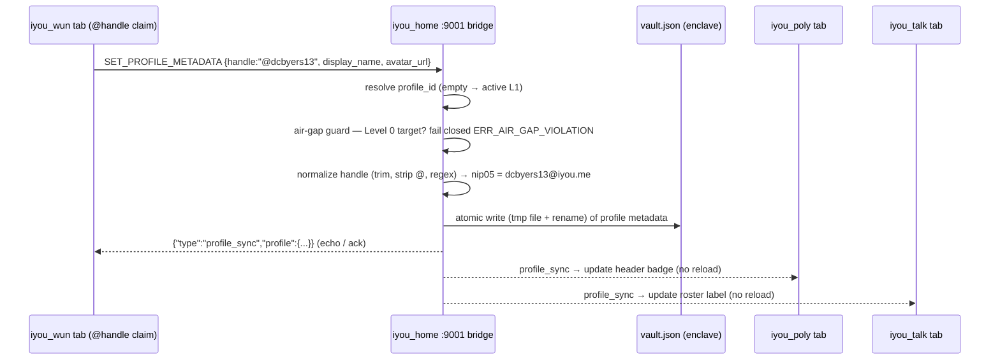

# RFC-006 — Universal Profile Metadata & Cross-Satellite Sync

**RFC ID:** `RFC-006`
**Title:** Universal Profile Metadata for the Omni-Social Federation
**Author:** iyou_home engineering (fed. protocol: `omni_social`)
**Target Release:** `v0.2.1+`
**Status:** Implemented (`commit b07f28b`) — Living Specification
**License Header:** GPL-3.0-or-later — Copyright (C) 2026 David Byers dba Byers Brands

---

## 1. Problem Statement

Every satellite in the Omni-Social federation (`iyou_wun`, `iyou_poly`,
`iyou_talk`, `iyou_play`, …) is a separate web-origin application. When a user
claims `@dcbyers13` inside `iyou_wun`, that handle is persisted only in a
satellite-local database table (`UserLinkDeck`) owned by the `iyou_wun`
origin. None of the sibling satellites can see it: browsers enforce
same-origin isolation, so `iyou_poly`, `iyou_talk`, and `iyou_play` run in
processes that cannot read `iyou_wun`'s rows.

The practical fallout of satellite-local identity state:

1. **Handle re-entry.** The user must re-claim their handle on every satellite
   they visit; the handle keystroke ceremony is repeated per origin.
2. **Fallback degradation.** Satellites that cannot resolve a handle fall back
   to raw 64-char hex strings or truncated `did:key` strings, which are opaque
   and hostile to humans.
3. **Drift.** A handle updated in `iyou_wun` silently goes stale in
   `iyou_poly` and `iyou_talk` until the user remembers to update each site.
4. **No persona cohesion.** Display name, avatar, banner, bio, and NIP-05
   identifier are re-entered per satellite, so the same person renders
   differently across the federation.

This RFC establishes the local `iyou_home` enclave as the **single authority**
for user-facing profile metadata — handle, display name, avatar, banner, bio,
and NIP-05 — and defines the Port 9001 signature-bridge wire contract that
propagates claimed or updated metadata across **every connected satellite**,
strictly preserving the Level 0 Air-Gap Invariant.

---

## 2. Goals / Non-Goals

### 2.1 Goals

- **One handle, everywhere.** A handle claimed or updated on any satellite is
  synchronized to every other satellite *and* to the enclave, in near real
  time, without page reloads.
- **Enclave authority.** `vault.json` is the authoritative store for profile
  metadata; satellites cache a projection for rendering, never an independent
  source of truth.
- **Air-gap preservation.** Derivation Index 0 (Anchor,
  `is_system_reserved == true`) can never receive public handles, avatars, or
  NIP-05 identifiers; any attempt fails closed.
- **Persona partitioning.** Metadata is scoped to derivation indices — the L1
  Public Persona holds public credentials, while L2+ burner personas hold
  fully isolated handles and display names.
- **Backward-compatible vault.** Existing `vault.json` files load cleanly;
  profiles without the new fields deserialize as `None`.

### 2.2 Non-Goals

- Not a new social graph store; contact data stays in `contacts.json`
  (RFC-002/003 machinery unchanged).
- Not a DNS registrar; the canonical NIP-05 suffix (`@iyou.me`) is derived
  locally, not provisioned by satellites.
- Not a media pipeline; avatars/banners reference content-addressed Blossom
  URLs or plain HTTPS, the enclave does not host them.
- Not a moderation surface; bans and pruning remain RFC-003.

---

## 3. Terminology

| Term | Meaning |
|---|---|
| **Satellite** | A federated `omni_social` web application (`iyou_wun`, `iyou_poly`, `iyou_talk`, `iyou_play`, …) running in a distinct web origin and connecting to the local enclave over `ws://127.0.0.1:9001`. |
| **Enclave** | The `iyou_home` Tauri + Rust process; sole holder of the root seed and the authority over profile metadata. |
| **Signature Bridge** | The TLS WebSocket daemon bound to `127.0.0.1:9001` (AGENT.md §2) that terminates all satellite↔enclave frames. |
| **UserLinkDeck** | A satellite-local Postgres table in which `iyou_wun` currently caches claimed handles. Post-RFC-006 it is a rendering cache, not ownership. |
| **Profile metadata** | The user-facing identity fields: `handle`, `display_name`, `avatar_url`, `banner_url`, `bio`, `nip05`. |
| **Canonical NIP-05** | The enclave-derived identifier `f"{handle}@iyou.me"` used for the `nip05` field. |
| **L0 / L1 / L2+** | Level 0 Anchor (`derivation_index == 0`, air-gapped), Level 1 Public Persona (`index == 1`, default signer), Level 2+ contextual burner personas. |

---

## 4. Core Principles & Strict Invariants

### 4.1 "Postgres is for Indexing, Not Ownership"

Satellites keep their Postgres tables (including `UserLinkDeck`) purely to
index and serve cached profile views for fast HTML rendering. The
**authoritative** user identity state is owned by the user's local `iyou_home`
enclave and persists in `vault.json`.

- Satellites treat incoming `profile_sync` frames as authoritative deltas and
  upsert their cache rows accordingly.
- A satellite may never *invent* metadata; it may only relay what the enclave
  signed or echoed.
- If the enclave is unreachable, satellites render from cache and mark the
  view "stale" rather than self-asserting a new identity.

### 4.2 Air-Gap Invariant (Level 0 Isolation)

Derivation Index 0 (`level == 0`, `is_system_reserved == true`) is the
air-gapped Anchor and **MUST NEVER** receive public handles, avatars, or
NIP-05 identifiers. The guard mirrors the existing bridge access evaluation
(`bridge.rs`: anchor profiles are never exposed to external frames — they
`is_anchor()` or `is_system_reserved`).

Any bridge frame attempting to write metadata to a Level 0 profile MUST fail
closed with:

```json
{
  "type": "error",
  "code": "ERR_AIR_GAP_VIOLATION",
  "message": "Level 0 identity is air-gapped from public profile metadata"
}
```

The same guard applies to outbound reads: `get_profile` and `profile_sync`
MUST only ever serialize the public persona (Level 1) or an explicitly
scoped non-anchor persona, never the Anchor.

### 4.3 Persona Partitioning

Profile metadata is strictly scoped to derivation indices:

| Persona | Index | Metadata Rule |
|---|---|---|
| Anchor (L0) | `0` | No public metadata. Any write → `ERR_AIR_GAP_VIOLATION`. |
| Primary / Public Persona (L1) | `1` (default `"primary"`) | Holds public credentials: handle, display name, avatar, banner, bio, `nip05`. Default target of `SET_PROFILE_METADATA`. |
| Burners (L2+) | `2+` | Fully isolated handles and display names; no cross-contamination with L1. |

**Active persona switching:** when the user switches the active persona inside
`iyou_home`, the enclave rebroadcasts an updated `profile_sync` across Port
9001 (see §6.3) so open satellite sessions dynamically re-anchor to the newly
active persona without a reload.

---

## 5. Vault Schema Evolution (`vault.rs`)

The canonical `Profile` struct gains seven serde-defaulted optional fields so
existing vaults deserialize untouched. The extension retains the existing
imported-key leaves (`imported_seed_b58`, `imported_nostr_sk_hex`); only the
RFC-006 block is new:

```rust
pub struct Profile {
    pub profile_id: String,
    pub profile_name: String,
    pub derivation_index: u32,
    pub did: String,
    pub credentials: Vec<VaultCredential>,
    pub nostr_pubkey_hex: String,
    pub level: u8,
    pub is_system_reserved: bool,
    pub active: bool,
    // (existing) imported_seed_b58: Option<String>,
    // (existing) imported_nostr_sk_hex: Option<String>,

    // RFC-006 Universal Identity Metadata
    #[serde(default, skip_serializing_if = "Option::is_none")]
    pub handle: Option<String>,        // e.g. "dcbyers13" (alphanumeric, no leading @)
    #[serde(default, skip_serializing_if = "Option::is_none")]
    pub display_name: Option<String>,  // e.g. "Dan Byers"
    #[serde(default, skip_serializing_if = "Option::is_none")]
    pub avatar_url: Option<String>,    // Content-addressed Blossom URL or HTTPS
    #[serde(default, skip_serializing_if = "Option::is_none")]
    pub banner_url: Option<String>,
    #[serde(default, skip_serializing_if = "Option::is_none")]
    pub bio: Option<String>,
    #[serde(default, skip_serializing_if = "Option::is_none")]
    pub nip05: Option<String>,         // e.g. "dcbyers13@iyou.me"
}
```

Schema invariants:

- **Serde defaults everywhere.** Every RFC-006 field uses
  `#[serde(default, skip_serializing_if = "Option::is_none")]`; absent keys
  deserialize to `None` and vanish from the serialized file when unset.
- **No re-derivation.** Metadata never participates in key derivation; DIDs,
  pubkeys, and derivation indices are unchanged by metadata writes.
- **Atomic persistence.** Writes to `vault.json` follow the AGENT.md §5
  fail-closed contract: staging file + `sync_all()` + atomic rename.

---

## 6. Port 9001 Bridge Protocol & Wire Contracts

Frames are JSON text messages over the Signature Bridge
(`ws://127.0.0.1:9001`, TLS-terminated; PNA pre-flights per AGENT.md §5).
Every frame carrying a payload is validated before any state mutation; on
validation or policy failure the bridge replies with an `error` frame (see
§6.4) and makes no change.

### 6.1 `SET_PROFILE_METADATA` (Ingress from satellite)

**Purpose:** claim or update profile metadata for a persona in the enclave.

**Request:**

```json
{
  "type": "SET_PROFILE_METADATA",
  "profile_id": "",
  "handle": "@dcbyers13",
  "display_name": "Dan Byers",
  "avatar_url": "http://127.0.0.1:9002/<sha256hex>",
  "banner_url": "https://cdn.iyou.me/banners/b.png",
  "bio": "Independent systems researcher."
}
```

**Resolution order:**

1. **Resolution.** `profile_id` is optional. Empty string defaults to the
   active Level 1 Public Persona (mirrors `get_profile_keypair(vault, "")`
   defaulting to `DEFAULT_PERSONA_PROFILE_ID`). A non-empty `profile_id` must
   resolve via `vault.get_profile_by_id(...)`; otherwise
   `ERR_PROFILE_NOT_FOUND`.
2. **Air-gap guard.** If the resolved persona `is_anchor() ||
   is_system_reserved` → `ERR_AIR_GAP_VIOLATION` (fail closed, no write).
3. **Normalization.** Trim whitespace on all string fields; strip a leading
   `@` from `handle`; validate `handle` against the canonical pattern. Compute
   `nip05 = f"{handle}@iyou.me"` from the normalized handle.
4. **Atomicity.** Persist to `vault.json` via temporary file + atomic rename.
5. **Broadcast.** Emit `profile_sync` to every active Port 9001 client (see
   §6.3), then reply to the requester with the same `profile_sync` envelope
   (echo/ack).

**Normalization rules (normative):**

- All string fields are trimmed of leading/trailing ASCII whitespace.
- A single leading `@` on `handle` is stripped before validation.
- `handle` MUST match `^[a-zA-Z0-9_-]{3,30}$` (alphanumeric, `-`, `_`;
   length 3–30). Violation → `ERR_INVALID_HANDLE` (`400` semantics).
- `nip05` is **always derived**, never client-supplied: `f"{handle}@iyou.me"`.
- Unsupplied fields are left untouched (partial update semantics — see
  acceptance criterion AC-3).

**Example response (echo):**

```json
{
  "type": "profile_sync",
  "profile": {
    "did": "did:key:z6Mk…primary",
    "nostr_pubkey_hex": "02…",
    "handle": "dcbyers13",
    "display_name": "Dan Byers",
    "avatar_url": "http://127.0.0.1:9002/<sha256hex>",
    "banner_url": "https://cdn.iyou.me/banners/b.png",
    "bio": "Independent systems researcher.",
    "nip05": "dcbyers13@iyou.me"
  }
}
```

### 6.2 `get_profile` (Pre-gate Query Update)

`get_profile` already resolves to the public persona only (Level 1) — the
Level 0 Anchor is never returned over the bridge. RFC-006 **extends** the
existing response payload with the new metadata fields alongside `did` and
`nostr_pubkey_hex`, while keeping the existing envelope shape:

```json
{
  "type": "get_profile"
}
```

responds:

```json
{
  "type": "profile_sync",
  "profile": {
    "profile_id": "primary",
    "profile_name": "Primary",
    "derivation_index": 1,
    "did": "did:key:z6Mk…",
    "nostr_pubkey_hex": "02…",
    "handle": "dcbyers13",
    "display_name": "Dan Byers",
    "avatar_url": null,
    "banner_url": null,
    "bio": null,
    "nip05": "dcbyers13@iyou.me"
  }
}
```

Fields the user has not yet set serialize as `null` (or are omitted per
`skip_serializing_if`); satellites MUST treat `null`/absent as "unset" and
render fallbacks rather than erroring.

### 6.3 `profile_sync` (Outbound Broadcast)

`profile_sync` is the canonical propagation envelope. The bridge dispatches it
to **all** active Port 9001 WebSocket clients (every open satellite tab) when:

- `SET_PROFILE_METADATA` completes (per §6.1), or
- the user switches the active persona inside `iyou_home` (re-anchoring open
  satellite sessions to the newly active persona).

```json
{
  "type": "profile_sync",
  "profile": {
    "profile_id": "primary",
    "derivation_index": 1,
    "did": "did:key:z6Mk…",
    "nostr_pubkey_hex": "02…",
    "handle": "dcbyers13",
    "display_name": "Dan Byers",
    "avatar_url": "http://127.0.0.1:9002/<sha256hex>",
    "banner_url": null,
    "bio": "Independent systems researcher.",
    "nip05": "dcbyers13@iyou.me"
  }
}
```

Satellites receiving `profile_sync` MUST upsert their cache projection
(`UserLinkDeck` row keyed by `did`) and re-render affected header badges,
roster labels, and profile cards **without reloading the page**. Delivery is
best-effort broadcast to currently-connected tabs; a satellite that was closed
at broadcast time re-hydrates from `get_profile` on its next connect.

### 6.4 Error Contract

All failures reply with a typed error frame; no state is mutated:

```json
{
  "type": "error",
  "code": "ERR_AIR_GAP_VIOLATION",
  "message": "Level 0 identity is air-gapped from public profile metadata"
}
```

| Code | Condition |
|---|---|
| `ERR_AIR_GAP_VIOLATION` | Target persona is Level 0 (`anchor` / `is_system_reserved`). |
| `ERR_PROFILE_NOT_FOUND` | Non-empty `profile_id` does not resolve in the vault. |
| `ERR_INVALID_HANDLE` | Normalized handle fails `^[a-zA-Z0-9_-]{3,30}$`. |
| `ERR_ENCLAVE_LOCKED` | Enclave app-lock is engaged; signing/scoped ops fail closed (existing contract). |
| `ERR_INVALID_FRAME` | Malformed JSON or missing required `type` field. |

---

## 7. Cross-Satellite Synchronization Flow



---

## 8. Satellite Storage Semantics (`UserLinkDeck` Migration)

Post-RFC-006, satellites shift from *owner* to *cache* for profile metadata:

1. **Seeds from the enclave.** On satellite boot, each satellite issues
   `get_profile` over `ws://127.0.0.1:9001` and upserts its `UserLinkDeck`
   row keyed by the returned `did`. No row is created from a bare form
   submission; claims go through `SET_PROFILE_METADATA` first.
2. **Follows `profile_sync`.** Every broadcast upserts the cache (handle,
   display name, avatar, banner, bio, `nip05`) and schedules a re-render of
   header badge / roster / profile-card components.
3. **Same-origin reads only.** Satellite UI components read from their local
   cache; cross-satellite consistency is guaranteed by the enclave's
   authority, never by scraping another origin.
4. **Fallback chain.** Unset metadata renders the existing fallbacks (raw
   hex, truncated DID) until the enclave provides values; satellites never
   invent handles.

---

## 9. Active Persona Switching & Session Re-anchoring

Because profile metadata is partitioned per derivation index (§4.3), switching
the active persona changes *which* metadata is canonical for open satellite
sessions:

1. User switches persona in `iyou_home` (e.g. L1, Primary → L2 burner).
2. The enclave resolves the newly active persona's metadata (burner handle,
   isolated display name).
3. The bridge broadcasts `profile_sync` with the new profile to all Port 9001
   clients.
4. Each open satellite re-anchors its session — header badge, roster label,
   and profile card refresh — with no reload and no cross-persona data
   leakage (the L2 handle never overwrites the L1 handle and vice versa).

Switching back to L1 re-broadcasts the L1 metadata identically. A persona with
no metadata set broadcasts its base profile (`did`, `nostr_pubkey_hex`) with
metadata fields `null`.

---

## 10. Acceptance Criteria & Test Matrix

### 10.1 Acceptance Criteria

- **AC-1 (Air-gap rejection):** `SET_PROFILE_METADATA` targeting
  `profile_id = "anchor"` (or any `is_system_reserved` profile) returns
  `ERR_AIR_GAP_VIOLATION` and writes nothing to `vault.json`.
- **AC-2 (Default routing):** an empty `profile_id` routes to the active
  Level 1 Public Persona and persists the metadata there.
- **AC-3 (Partial-update preservation):** submitting only `display_name`
  leaves `handle`, `avatar_url`, `banner_url`, `bio`, and existing `nip05`
  untouched.
- **AC-4 (Backward compatibility):** a pre-RFC-006 `vault.json` (profiles
  without the new keys) loads cleanly — no deserialization error, no field
  loss — and reserializes byte-identically.
- **AC-5 (Normalization):** `"@dcbyers13"` and `"  dcbyers13  "` both
  normalize to `"dcbyers13"`; an out-of-pattern handle (`"a"`, `"has space"`,
  `"a".repeat(31)`) is rejected with `ERR_INVALID_HANDLE`.
- **AC-6 (Canonical NIP-05):** after any successful `SET_PROFILE_METADATA`
  with a valid handle, `nip05 == f"{normalized_handle}@iyou.me"`.
- **AC-7 (Atomic persistence):** a simulated crash mid-write leaves the
  previous `vault.json` intact (staging file + rename contract).
- **AC-8 (Broadcast):** a successful `SET_PROFILE_METADATA` emits exactly one
  `profile_sync` to every connected Port 9001 client; a persona switch emits
  one additional `profile_sync`.
- **AC-9 (Satellite cache semantics):** a satellite upserts its
  `UserLinkDeck` row from `get_profile`/`profile_sync` and re-renders without
  reload.
- **AC-10 (Persona isolation):** writing metadata to a Level 2+ burner never
  mutates Level 1 fields and vice versa.

### 10.2 Test Matrix

| # | Test | Scenario | Expected Result | Gate |
|---|---|---|---|---|
| T-1 | L0 write rejection | `SET_PROFILE_METADATA, profile_id:"anchor"` | `ERR_AIR_GAP_VIOLATION`, no write, L0 vault bytes unchanged | AC-1 |
| T-2 | Default L1 routing | empty `profile_id`, valid handle | metadata persisted on active L1; `get_profile` returns it | AC-2 |
| T-3 | Partial update | only `display_name` submitted | other fields preserve prior values | AC-3 |
| T-4 | Legacy vault load | pre-RFC-006 `vault.json` fixture | deserializes cleanly; profiles' new fields `None` | AC-4 |
| T-5 | Handle normalization | `"@dcbyers13"`, `" dcbyers13 "`, invalid patterns | valid variants → `"dcbyers13"`; invalid → `ERR_INVALID_HANDLE` | AC-5 |
| T-6 | NIP-05 derivation | handle `dcbyers13` | `nip05 == "dcbyers13@iyou.me"` | AC-6 |
| T-7 | Atomic write | crash injected at rename boundary | prior `vault.json` remains valid | AC-7 |
| T-8 | Broadcast fan-out | 2 satellite tabs connected | both tabs receive `profile_sync`; requester gets echo | AC-8 |
| T-9 | Cache upsert | satellite receives `profile_sync` | `UserLinkDeck` row keyed by `did` upserted; UI re-renders | AC-9 |
| T-10 | Persona isolation | write L2 burner; read L1 | L1 metadata unchanged; both broadcast independently | AC-10 |

---

## 11. Open Questions

1. **Multi-device conflict.** Two devices mutate the same profile metadata in
   the same second; last-writer-wins is the default. Should the enclave emit an
   event-sourced revision per device (`device_id` from `pairing.json`) before
   shipping?
2. **NIP-05 provisioning.** Should the canonical `@iyou.me` domain be resolved
   through a registry lookup on remote relays, or is the local derivation
   (`f"{handle}@iyou.me"`) authoritative until a DNS-side verification flow
   exists?
3. **Avatar upload UX.** The enclave references Blossom URLs but does not host
   avatar bytes. Should `SET_PROFILE_METADATA` accept raw blob bytes for a
   nested PUT to the local `:9002` store, or remain URL-only?
4. **Burner auto-handles.** Should L2+ burners auto-generate ephemeral handles
   (`quiet_otter_12`) at derivation time to avoid `null`-handle states in
   satellite rosters?

---

## 12. Document History

- **2026-09-18 (v1.0.0):** Initial RFC. Enclave-authority model for universal
  profile metadata (handle, display name, avatar, banner, bio, NIP-05);
  additive `Profile` schema evolution; `SET_PROFILE_METADATA` /
  `profile_sync` wire contracts; Level 0 air-gap enforcement; persona
  partitioning and active-persona re-anchoring; satellite `UserLinkDeck`
  cache migration; acceptance criteria and test matrix.
- **2026-09-19 (v1.1.0):** Promoted from Draft to **Implemented** (commit
  `b07f28b`) for release v0.2.2; status header updated.